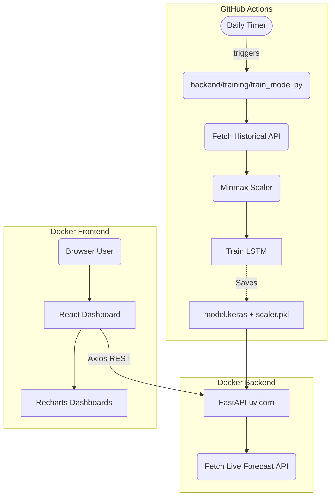

# Real-Time Weather Prediction System

The platform has been fully generated and is ready to use! The system achieves an end-to-end flow from fetching Open-Meteo historical and live data, training an LSTM model using TensorFlow, serving it via FastAPI, and displaying predictions on a React + Vite dashboard.

## System Architecture


> Note: The real architecture relies on docker-compose interconnecting the backend and frontend, and GitHub Actions managing the automated ML retraining.



## Running the Application

I've set up complete Docker integration. You can bring up both services locally simultaneously.

> [!IMPORTANT]
> The backend expects the ML models to reside in `backend/models`. They will be empty initially until you trigger a training iteration.

### Automated Training (Local Step 1)
To bootstrap the application and get the initial LSTM model:
```bash
cd backend
python -m venv venv
venv\Scripts\activate
pip install -r requirements.txt
python -m training.train_model
```
_This process retrieves Open-Meteo Data, trains for 15 epochs, and saves `scaler.pkl` and `model.keras` to `backend/models`._

### Starting the Servers (Step 2)
Simply return to the root folder `d:/disk d/Weather-Forecast` and orchestrate the containers:
```bash
docker-compose up --build
```
- **React Frontend**: `http://localhost:3000`
- **FastAPI Specs**: `http://localhost:8000/docs`

## Features Included

- **Backend**
  - Uses `openmeteo-requests` to efficiently call the archive API.
  - Slices data with a rolling sliding window of 24 hours.
  - Predicts features including Temperature, Humidity, Wind speed, Pressure, Precipitation, and Weather ID.
- **Frontend**
  - A modern aesthetic fueled by **Tailwind CSS**.
  - Direct integration with open browser geolocation `navigator.geolocation`.
  - Advanced visualization via `Recharts` overlaying the API's standard prediction vs our custom LSTM output.

## GitHub Actions Overview
The `.github/workflows/` directory contains workflows designed for **free tier orchestration**:
1. `tests.yml`: Validates code logic and styling issues on PR.
2. `retrain.yml`: Triggers on a `cron` cycle every day at midnight UTC. It boots a Linux VM, queries the latest weather differences, retrains the Keras model dynamically, and pushes the new `.keras` artifact directly back to the repo branch.
3. `deploy.yml`: Ready to adapt variables enabling deployment of the `Dockerfile` assets to Railway and Vercel.
